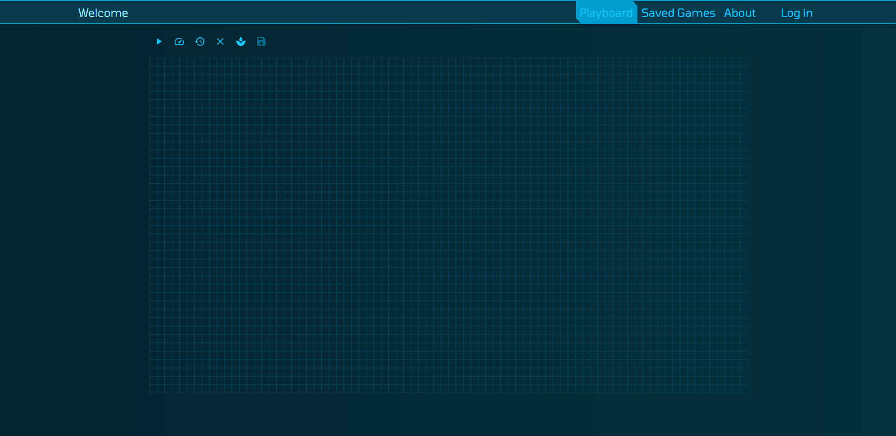
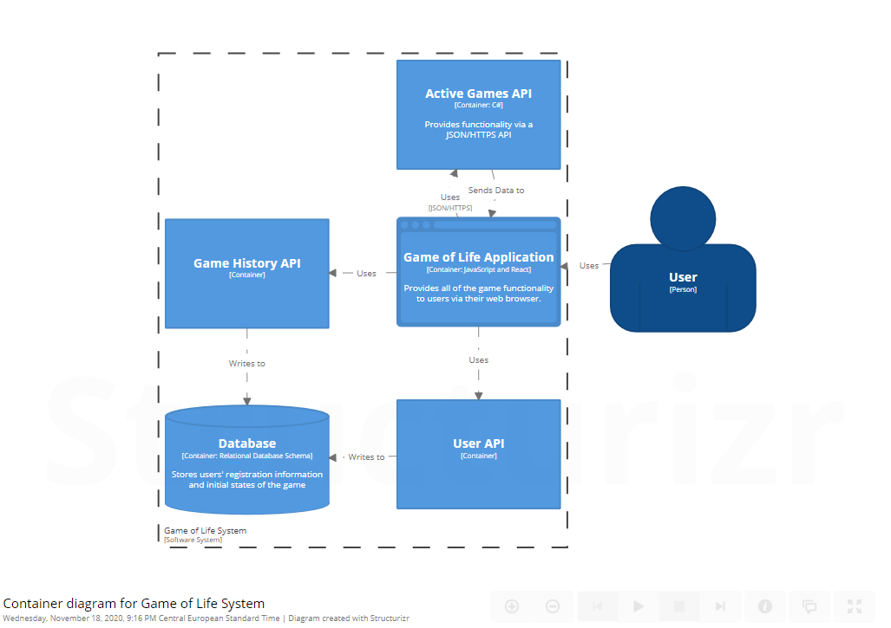

# Game of Life

## About

Game of Life is a project that simulates John Conway's game of life. The project is divided into 4 services: a React application and 3 .NET Core APIs (Active Games API, User API, Game History API). When the first generation is drawn/made, it is sent to the Active Games API which calculates the total number of generations for that game and returns the information using SignalR. At the same time, the React application calculates and displays the
generations for that game.

 

  

The 3 APIs are on GitHub at [https://github.com/robertarotaritei/GameOfLifeAPIs](https://github.com/robertarotaritei/GameOfLifeAPIs).

This is the container view of the project:

 

  

## Local environment

Requirements:
- Docker Desktop

Run the command

### `docker-compose up -d`

in the root folder of the project and visit [localhost:80](localhost:80) to see the project.

## Live version (temporary)

Using a CI/CD pipeline, the 4 applications are tested, deployed to Docker, pulled to Microsoft Azure, and hosted on two websites. The React application, User API and Game History API are connected with Docker-compose at [https://gameoflifeapp.azurewebsites.net](https://gameoflifeapp.azurewebsites.net). The Active Games API which uses SignalrR is hosted at [https://activegamesapi.azurewebsites.net](https://activegamesapi.azurewebsites.net).

## Live version (simplified)

A simplified version of the project is live at [https://robertarotaritei.github.io/game-of-life](https://robertarotaritei.github.io/game-of-life).

It only features the React application, making it easy to access and change the Game of Life grid.

## Website navigation help

The website displays a navigation bar at the top of the page with 4 buttons: Playboard, Saved Games, About and Log in/Log out.

The Playboard tab shows a 40 by 80 grid with 6 buttons on top. The grid can be clicked and dragged to create the first generation of the game.

The 6 icon buttons displayed on the top side of the grid can be used to interact with the game. The first button is the ‘Play’ button. It turns to ‘Pause’ once clicked and ‘Resume’ if clicked again. The second button is the ‘Speed’ button which sets the speed at which the generations are displayed. If clicked, two more buttons will pop up for ‘Slow’ and ‘Fast’ options, respectively. The third button is the ‘Rewind’ button which reverts the game back to the first generation. The fourth button is the ‘Clear’ button which clears the grid, if clicked. The fifth button is the ‘Seed’ button which randomly places ‘life’ on 60% of the board. The last button is the ‘Save’ button which lets users save games if they are logged in. Pressing this button will display a successful/unsuccessful text.

The Saved Games tab shows a list of all saved games. The only buttons displayed are the ‘Play’ ‘Speed’ and ‘Rewind’ buttons. A user can only play a saved game, not modify it in any way.

The About tab shows information about the Game of Life and the website.

Clicking on Log in displays the Login Form. If the user does not have an account, they can press on
the ‘register’ button which will show the Registration Form. If they want to go back to the game without
logging in, they can press the ‘Go back to the game’ button.